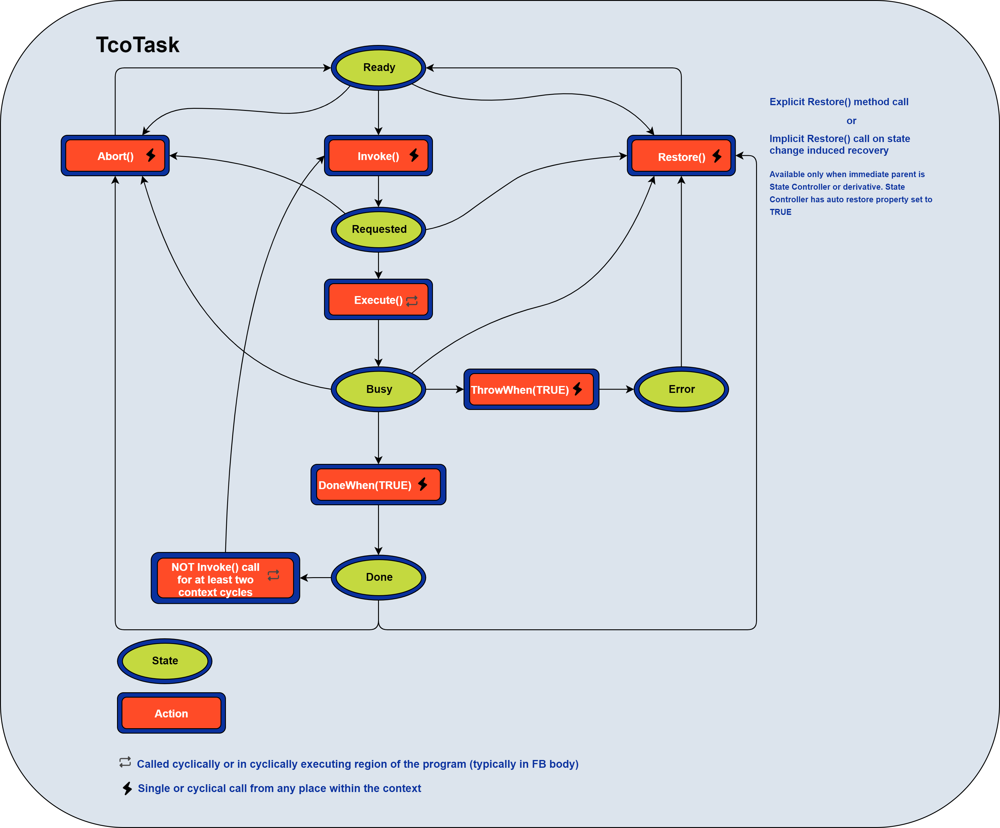
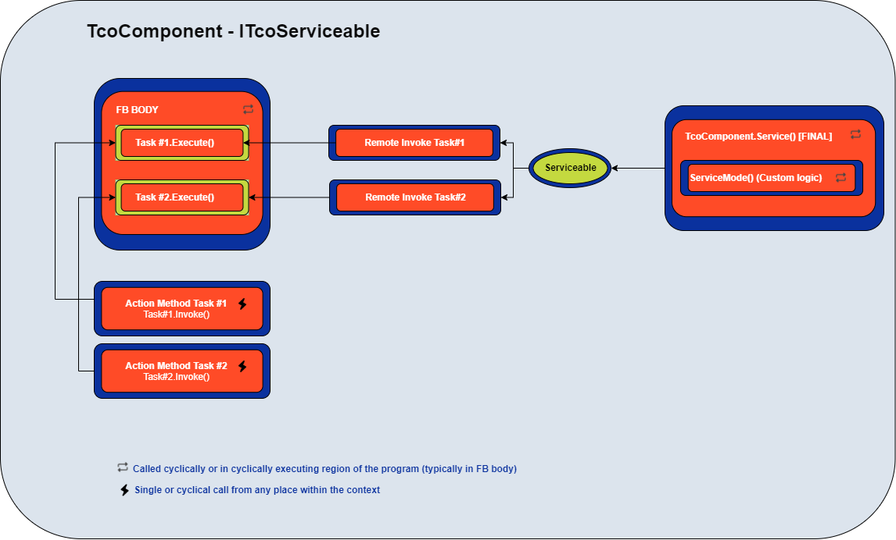
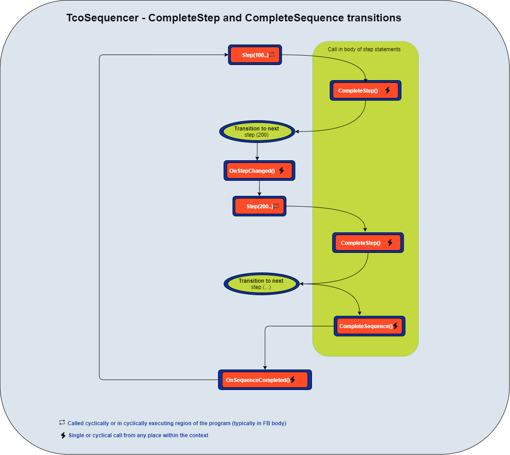

# TcOpen Framework application

## TcoCore

```TcoCore``` library contains basic classes for building TcOpen applications (components, tasks management, coordination primitives). The default namespace for this library is ```TcoCore```. All types in this library have ```Tco``` prefix for classes and ```ITco``` and for interfaces. 

### Contex (TcoContext : ITcoContext)

```TcOpen``` application requires to have at least one ```TcoContex``` that provides contextual and support information and services for the application components.
```TcoContext``` is an abstract class that requires the ```Main``` method implementation that is the **root of the call tree** for that context (station, functional unit, or whole application). Context can encapsulate units of different scope and size. Each context is an isolated island that manages only the objects declared within its declaration tree. Each ```TcoObject``` (more later) can have only one context. Inter-contextual access between the objects is not permitted. The context executes with ```Run``` method call from the PLC program. The ```Run``` method will take care of running ```Main``` method and other routines that are required for the context and its services.

Context usage scenarios:


** example of context implementation**

Implementation of abstract ```TcoCore.TcoContext``` class

~~~iecst
FUNCTION_BLOCK ExampleContext EXTENDS TcoCore.TcoContext
VAR    
    // Primitive state controller
	_automat : TcoCore.TcoState(THIS^, TRUE);     
    _someComponent : SomeComponent(THIS^);
END_VAR
~~~

Implementation of abstract method ```Main```

~~~iecst
METHOD PROTECTED  Main
//-------------------------------------------------------------
IF(_automat.State = 0) THEN
    _someComponent.DoSomething()
    _automat.ChangeState(10);
END_IF;

IF(_automat.State = 10) THEN
    IF(_someComponent.Done) THEN
        _automat.ChangeState(20);
    END_IF;    
END_IF;

IF(_automat.State = 20) THEN
    IF(_someComponent.DoSomethingElse().Done) THEN
        _automat.ChangeState(0);
    END_IF;    
END_IF;
.
.
.
.
.
~~~

Execution of the context. Here we call ```Run```. It will implicitly call the ```Main```method implemented have above.

~~~iecst
PROGRAM MAIN
VAR
	_context : ExampleContext;
END_VAR
//-------------------------------------
_context.Run();
~~~

### Tasks (TcoTask : ITcoTask)

```TcoTask``` is a class for managing chunks of logic in asynchronous execution.

```TcoTask```implements ```Execute``` method that must be accessed cyclically (typically in the body of a Function Block).



~~~
// Body of a FB
IF(_myTask.Exectute()) THEN
    _counter := _counter + 1;
    _myTask.DoneWhen(_counter = 100);
END_IF;
~~~

The task executes upon the ```Invoke``` method call. ```Invoke``` fires the execution of ```Execute``` logic upon the first call, and it does not need cyclical calling. 

~~~
_myTask.Invoke();
~~~

```Invoke``` method returns ```ITcoTaskStatus``` with the following members:

1. ``` Busy``` indicates the execution started and is running.
1. ``` Done``` indicates the execution completed with success.
1. ``` Error``` indicates the execution terminated with a failure.
 
~~~iecst
// Wait for the task to complete
IF(_myTask.Invoke().Done) THEN
    ; // Do something
END_IF;

// ALTERNATIVELY

_myTask.Invoke();

IF(_myTask.Done) THEN
    ; // Do something
END_IF;

~~~
~~~iecst
// Make sure that the task is executing
IF(_myTask.Invoke().Busy) THEN
    ; // Do something
END_IF;    
~~~
~~~iecst
// Check for task's error.
IF(_myTask.Invoke().Error) THEN
    ; // Do something
END_IF;    
~~~


After task completion, the state of the task will remain in ```Done```, unless:

1. Task's ```Restore``` method is called (task moves to ```Ready```state).
1. ``` Invoke``` method is **not called** for two or more cycles of its context (that usually means the same as PLC cycle); successive call of ```Invoke``` will switch the task into ```Ready``` and immediately to ```Requested``` state.
1. If the task is part of complex coordination primitive, the transition between states will bring the task into a ```Ready``` state if that primitive (StateController and derivatives) has this option enabled.
1. Alternatively, a ```Restore``` of a task can be called in transition methods of complex coordination primitives(```OnStateChange```).


The task may finish in an ``` Error``` state. In that case, two recovery scenarios are possible:
1. Task's ```Restore``` method is called (task goes to ```Ready```state).
1. ``` Restore``` from **on transition** methods. 

### Components (TcoComponent : ITcoComponent)

The component in TcOpen is a Function Block/class that controls a physical (Robot, Piston, Drive) or virtual (Operator, Warehouse) component. 
Another way of thinking about this concept is an ```API/Driver``` that allows the consumer to execute and manage a physical or virtual appliance.


**Simple pneumatic cylinder implementation**

~~~iecst
FUNCTION_BLOCK PneumaticCyclinder EXTENDS TcoCore.TcoComponent, IMPLEMENTS IPneumaticCyclinder
VAR_INPUT
    inHomeSensor : BOOL;
    inWorkSensor : BOOL;    
END_VAR    

VAR_OUTPUT
    outMoveHomeSignal : BOOL;
    outMoveWorkSignal : BOOL;
END_VAR    

VAR
    _MoveHomeTask : TcoCore.TcoTask(THIS^);
    _MoveWorkTask : TcoCore.TcoTask(THIS^);
END_VAR
//--------------------------------------------------------
                   FB BODY [CYCLIC CALL]
//--------------------------------------------------------
IF(_MoveHomeTask.Execute()) THEN
    outMoveHomeSignal := TRUE;
    outMoveWorkSignal := FALSE;
    _MoveHomeTask.DoneWhen(inHomeSensor);
END_IF;    

IF(_MoveWorkTask.Execute()) THEN
    outMoveHomeSignal := FALSE;
    outMoveWorkSignal := TRUE;
    _MoveWorkTask.DoneWhen(inWorkSensor);
END_IF;
//--------------------------------------------------------
                   MoveHome Method
//--------------------------------------------------------
METHOD PUBLIC MoveHome : ITcoTaskStatus
//----
MoveHome := _MoveHomeTask.Invoke();

//--------------------------------------------------------
                   MoveWork Method
//--------------------------------------------------------
METHOD PUBLIC MoveWork : ITcoTaskStatus
//----
MoveWork := _MoveWorkTask.Invoke();
~~~


Component must not contain any application-specific code to be reusable by other consumers.

* Component must inherit from ```TcoCore.TcoComponent```
* Components methods and properties should not be marked FINAL (sealed)
* Component should implement appropriate ```INTERFACE``` for a public contract. The interface must not change during the lifetime of the particular major version of the library/framework.
* Component members must explicitly state access modifier for methods and properties (```PUBLIC```, ```INTERNAL```, ```PROTECTED```, or ```PRIVATE```)
* Component should properly hide implementation details by marking methods preferably ```PROTECTED```.
* Consider using the ```PRIVATE``` access modifier to prevent any access to that member if you deem it necessary. Be aware, though, that private members cannot be overridden by inheriting class. 
* If there are any testing methods in the same library with the component, these must be marked ```INTERNAL```.
* Each action of the component should be implemented using the ```TcoTask``` class. The exception to this rule is the actions that require a single cycle to complete. Task's ```Invoke``` should be placed into a method with an appropriate name (MoveAbsolute, MoveHome, Measure).

### Cyclic call

Each component implements the logic required to run cyclically in the *body* of the Function Block. The body of the Function Block must be called from an appropriate place in the PLC program.

### Components methods

The methods that perform actions **MUST** return ```TcoCore.ITcoTaskStatus```(typically ```TcoCore.TcoTask```). This rule applies even to the logic that requires a single-cycle execution.

### Serviceablity

```TcoComponent``` implements ```ITcoServiceable``` interface. Serviceablity means that the task's execution can be triggered from outside PLC environment (HMI/SCADA). All tasks of the declared in the component will became ```serviceable``` when ```TcoComponent.Service()``` method is called cyclically. The ```Service``` method is final and cannot be overriden; you can however place custom logic in the override of ```ServiceMode``` method its call is ensured by ```Service``` method.

Serviceable mode would be typicaly used in manual mode of a unit.



## State (TcoState : ITcoState)

The state controller ```TcoState``` is the primary class for managing control over states of the system. It has a simple implementation for changing and observing the state. It allows handling the state coordination with any statements (IF-END_IF, IF-ELSIF-END_IF, CASE). ```TcoState``` holds the control variable and manages the change via ```TcoState.ChangeState(newState)```. The override of the ```TcoState.OnStateChange(lastState, newState)``` method allows to perform operation on transition between the states.

~~~iecst
IF(State = 10) THEN
    IF(a.DoSomething().Done) THEN
        ChangeState(20).Restore(a).Restore(b);  // Change state and restore objects 'a'  and 'b'
    END_IF;    
END_IF;    

IF(s.State = 20) THEN
    IF(a.DoSomething().Done) THEN
        ChangeState(10);    
    END_IF;    
END_IF;    

//--------------------------------------------------
// Override of OnStateChange method
//--------------------------------------------------
METHOD PROTECTED OnStateChange
VAR_INPUT
	PreviousState	: INT;
	NewState 		: INT;
END_VAR

// On transition to state 10
IF(NewState = 10) THEN
    logger.Log('Transitioning to state no 10');
    a.Restore();
END_IF;    
~~~

#### Restoring state of objects

The restorable objects alleviate the burden of finding the right place and time for restoring objects in the PLC program.

Any object that implements correctly ```ITcoRestorable``` is eligible for implicit auto-restore. ```ITcoRestorable.Restore()``` method must implement the logic that brings the object to the initial state ```Ready``` and thus make it ready for the new execution. 

We already mentioned restoring mechanisms in the section about ITcoTask```. The example above demonstrates two ways of performing **explicit** the auto restore:

1. In the state ```10``` call ```s.ChangeState(20).Restore(a).Restore(b)``` restores state of the object ```a``` and ```b```;
1. In the override ```OnStateChange```, we restore only object ```a'  ".

**Implicit** restoring mechanism restores object without explicit coding. There are two ways the object can be restored:

1. The objects that are **directly declared** in the body of the object of ```ITcoState``` will be restored when

    1. The ```ITcoState``` changes state,
    1. ```ITcoState``` is configured auto-restorable,
    1. ```IRestorable``` object is a direct member of the ```ITcoState```.

In this case, the state of the child objects is restored when the state of the parent ```ITcoState``` changes.

~~~iecst
//---------------------------------------------------------
FUNCTION_BLOCK MyContext EXTENDS TcoCore.TcoContext
VAR
    _myState : MyStateController(THIS^, eRestoreMode.AutoRestoreMembers); // TRUE INDICATES THE STATES MEMBERS ARE AUTO-RESTORABLE
END_VAR   
//---------------------------------------------------------
FUNCTION_BLOCK MyStateController : EXTENDS TcoCore.TcoState
VAR
    a : MyComponentThasDoesSomething(THIS^);
END_VAR;    

IF(State = 10) THEN
    IF(a.DoSomething().Done) THEN
        ChangeState(20); 
    END_IF;    
END_IF;    

IF(s.State = 20) THEN
    IF(a.DoSomething().Done) THEN
        ChangeState(10);    
    END_IF;    
END_IF;    
~~~

2. The classes that implement the auto-restorable mechanism (```TcoTask```) will restore its state upon the call of the method executing an action, provided that there were at least two consecutive cycles of the context where that executing method was not called.


### Sequencer (TcoSequencer : ITcoSequencer)

The sequencer provides more advanced coordination of PLC logic. As the name suggests, the logic is organized in sequence. The steps run in the order in which they are written in the program.

```TcoSequncer``` is an abstract class, and it must have a concrete implementation of ```Main``` method. ```Main``` is the entry point for the sequence logic.


In addition to simple sequential coordination, this class permits manual step-by-step execution, moving the pointer backward and forward in the sequence. ```TcoSequencer``` also implements the auto-restorable mechanism analogous to ```TcoState```.

~~~iecst

FUNCTION_BLOCK MySequencer EXTENDS TcoCore.TcoSequencer
VAR
    _lightR_IsOn : BOOL;
    _lightG_IsOn : BOOL;
    _lightB_IsOn : BOOL;

    _lightR_SwitchOn : BOOL;
    _lightG_SwitchOn  : BOOL;
    _lightB_SwitchOn  : BOOL;

    _luminosityMin : REAL;
    _luminosity : REAL;
    _luminosityMax : REAL;    
END_VAR

(******************************************************)
METHOD PROTECTED FINAL Main

(******************************************************)
// Step header
IF Step(100,                                // Step id. Must be unique and must change at runtime.
        TRUE,                               // Indicates that whether the step should execute.
        'Switch all lights off') THEN       // Arbitrary step description (for SCADA/HMI)
//--------------------------------------------    
// Steps logic statements
    _lightR_SwitchOn := FALSE;
    _lightG_SwitchOn := FALSE;
    _lightB_SwitchOn := FALSE;

    IF(NOT _lightR_IsOn 
       AND NOT _lightG_IsOn 
       AND NOT _lightB_IsOn) 
    THEN
        CompleteStep(); // Completes step and moves to step 200
    END_IF;
//--------------------------------------------
END_IF;    

IF Step(200,
        TRUE,
        'Switch on red light') THEN
//--------------------------------------------    
    _lightR_SwitchOn := TRUE;
    IF(_lightR_IsOn) THEN
        CompleteStep();
    END_IF;
//--------------------------------------------
END_IF;

IF Step(300,
        TRUE,
        'Switch on green light') THEN
//--------------------------------------------    
    _lightG_SwitchOn := TRUE;
    IF(_lightG_IsOn) THEN
        CompleteStep();
    END_IF;
//--------------------------------------------
END_IF;

IF Step(400,
        TRUE,
        'Switch on blue light') THEN
//--------------------------------------------    
    _lightB_SwitchOn := TRUE;
    IF(_lightB_IsOn) THEN
        CompleteStep();
    END_IF;
//--------------------------------------------
END_IF;

IF Step(500,
        TRUE,
        'Check that all light are on') THEN
//--------------------------------------------        
    IF(_lightR_IsOn 
    AND _lightG_IsOn 
    AND _lightG_IsOn) 
    THEN
        CompleteStep();
    ELSE
        RequestStep(200); // Some light(s) is(are) not on, try again from 200    
    END_IF;
//--------------------------------------------
END_IF;


IF Step(600,
        TRUE,
        'Measure luminosity') THEN
//--------------------------------------------        
    IF(_luminosity_min =< _luminosity AND _luminosity_max >= _luminosity) THEN
        CompleteStep();
    ELSE
        RequestStep(500); // Luminosity is not where it should be; check again if the lights are on.    
    END_IF    
//--------------------------------------------
END_IF;

IF Step(800,
        TRUE,
        'Complete sequence') THEN
//--------------------------------------------        
        CompleteSequence(); // Returns to the first step (100) in the sequence.    
//--------------------------------------------
END_IF;
~~~



#### Requesting step

```TcoSequener.RequestStep(INT)``` it is similar to ```goto``` or ```JMP``` except that the jump occurs at sequencer's level. If the requeste step is past the step that made the request, the requested step will execute in the same PLC cycle. If the requested step is prior to the step where the request was issued, the step will execute in the next contexts cycle.

#### Cyclic mode

The ```cyclic mode``` runs the steps until it reaches the step in the sequence that invokes ```CompleteSequence()``` method; this method moves the sequencer's pointer to the first step in the sequence, it also registers the time of the sequence and prepares the sequencer for the next run.


#### Step mode

```Step mode``` allows running step-by-step operations. At the transition from ```Cyclic``` to ```Step``` mode, the running step runs to completion, the sequencer's pointer moves to the next available step but does not run the step logic.

When ```StepIn``` task executes, the step runs its logic to the completion; the pointer moves to the next step but does not execute that step's logic.
Step mode allows moving the pointer of the sequence ```forward``` and ```backward```; at each run of this commands running step's run terminates, and the pointer moves to the respective step.
