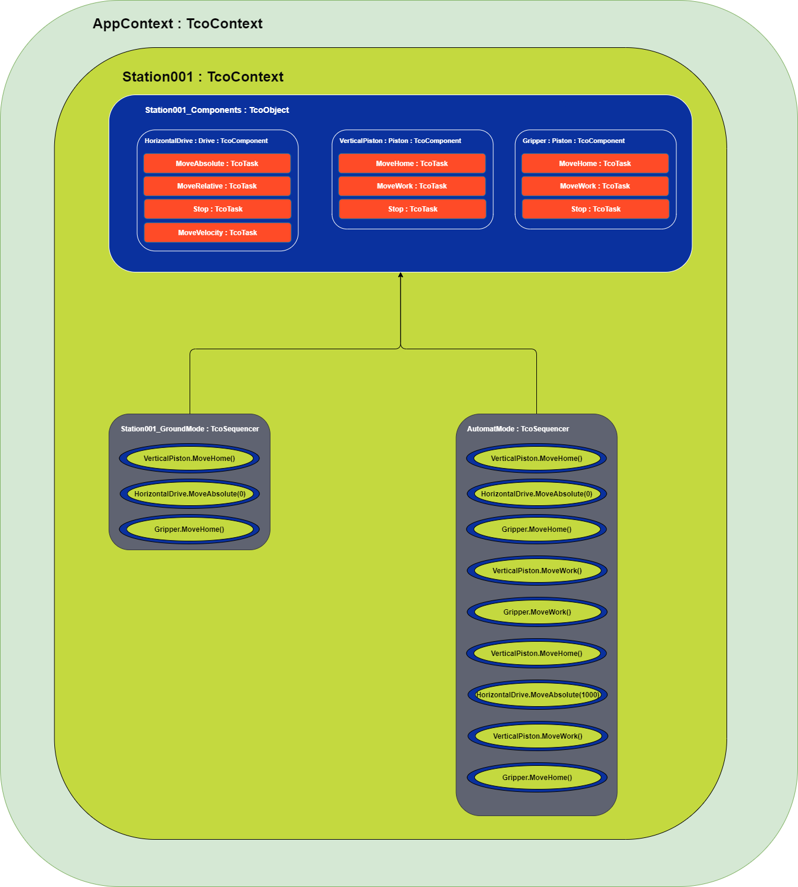

# TcOpen Framework

TcOpen framework provides blocks for building industrial applications and creating reusable software components for various devices like Pistons, Drives, Robots, Vision systems, etc.

Part of the framework is a series of classes/blocks for crafting applications using techniques known from software engineering. TcOpen is created in the OOP paradigm and takes full advantage of object-oriented design allowed by CoDeSys/TwinCAT 3 implementation of IEC-61131-3.

The ultimate goal of this initiative is to provide automation engineers with **well-designed**, **testable**, **scalable**, and **reusable** blocks to facilitate the development, commissioning, and maintainability of the industrial application software.

## TcOpen application dissection

The following diagram shows schematics of a simple TcOpen application. The station contains a manipulator with a single drive for a horizontal axis movement, a pneumatic piston for vertical axis movement, and a pneumatic gripper.



The blocks of an TcOpen application require to be nested into a root block called [Context]((#Context)) that derives from ```TcoContext``` or implements ```ITcoContext``` interface. In our case, it is ```AppContext``` block.

The next level is ```Station001``` that derives from [TcoObject](#Object) (about TcoObject later). It suffices to say the ```TcoObject``` is the base block of each other block in the TcOpen framework.

The [components](#Components) (drive, pistons) are encapsulated into a single structure, ```Station001_Components``` (HorizontalDrive, VerticalPiston, Gripper) and it that also derives from ```TcoObject```.

Besides components, the station contains two [Sequences](#Sequencer), ```Station001_GroundMode``` that brings the manipulator to the ground state (home positioning), and ```Station001_AutomatMode``` that performs the manipulator's activities in automatic mode.

The components (Drive, Piston) have a set of tasks (MoveHome, MoveAbsolute, etc.). All tasks are or derive from [TcoTask](#Task) within which the actions are running. The [TcoTask](#Task)  work with two methods in tandem: ```Invoke``` fires the execution (in our case, this occurs in the sequences) and ```Execute``` with an implementation in the components block, that run the required action.

# TcoCore library

```TcoCore``` library contains basic classes for building TcOpen applications (components, tasks management, coordination primitives). The default **namespace** for this library is ```TcoCore```. All types in this library have ```Tco``` prefix for classes and ```ITco``` and for interfaces.

## Context

**(TcoContext : ITcoContext)**

[API](~/api/TcoCore/PlcDocu.TcoCore.TcoContext.html)

```TcoContext``` is an entry point for an application. It represents a station, functional unit, or a whole application. The `Main` method of the context is the **root of the call tree**.

```TcOpen``` application requires to have at least one ```TcoContex```.

Context can encapsulate units of different scope and size. Each context is an isolated island that manages only the objects declared within its declaration tree. Each ```TcoObject``` (more later) can have only one context. Inter-contextual access between the objects is not permitted. The context executes with ```Run``` method call from the PLC program. The ```Run``` method will take care of running ```Main``` method and other routines that are required for the context and its services.

<!-- Context usage scenarios:

 -->

**Example of context implementation**

Implementation of abstract ```TcoCore.TcoContext``` class

~~~iecst
FUNCTION_BLOCK ExampleContext EXTENDS TcoCore.TcoContext
VAR    
    // State control variable
	_state : INT;    
    // Piston component
    _piston : Piston(THIS^); // About the construction via FB_init later.  
END_VAR
~~~

Implementation of abstract method ```Main```

~~~iecst
METHOD PROTECTED Main
//-------------------------------------------------------------
IF(_state = 0) THEN
    IF(_piston.MoveWork().Done) THEN
      _state := 10;
    END_IF;  
END_IF;

IF(_state = 10) THEN
    IF(_piston.MoveHome().Done) THEN
      _state := 20;
    END_IF;    
END_IF;
.
.
.
.
.
IF(_state = 20) THEN
    _state := 0;
END_IF;
~~~

Execution of the context. Here we call ```Run```. It will implicitly call the ```Main``` method implemented have above.

~~~iecst
PROGRAM MAIN
VAR
	_context : ExampleContext;
END_VAR
//-------------------------------------
_context.Run();
~~~

## Object

**(TcoObject : ITcoObject)**

[API](~/api/TcoCore/PlcDocu.TcoCore.TcoObject.html)

`TcoObject` provides access to :
- [Context](#Context)
- Reference to the parent object
- [Identity](https://docs.tcopengroup.org/api/TcoCore/TcoCore.TcoObject.PlcTcoObject.html#TcoCore_TcoObject_PlcTcoObject_Identity) (unique identifier across application)
- Access to a [*messaging system*](https://docs.tcopengroup.org/api/TcoCore/TcoCore.TcoObject.PlcTcoObject.html#TcoCore_TcoObject_PlcTcoObject_Messenger)
- and other useful functions. (e.g. RTC)

Each block in ```TcOpen``` framework should derive from ```TcoObject```. 

If we stretch our imagination, we can think of ```TcoObject``` as ```object``` in C# (all objects derive from ```System.Object```);

### TcoObject construction (FB_init)

```TcoObject``` must be constructed via ```FB_init``` method passing in a parameter of parent ```ITcoObject```; that is usualy another ```TcoObject``` or a ```TcoContext``` eventualy other type that implements ```ITcoObject``` interface.

> As a rule, all objects should be constructed as follows:

~~~
VAR
    _drive : Drive(THIS^);
END_VAR    
~~~

where ```THIS^``` is of ```ITcoObject```.

---------------------------

### Messenger

[API](https://docs.tcopengroup.org/api/TcoCore/TcoCore.TcoMessenger.PlcTcoMessenger.html)

Any ```TcoObject``` can post messages of different severity ulterior use in higher-level applications (HMI/SCADA).

 Each ```TcoObject``` contains a single message holder ```Mime``` or Most Important Message.
 
The message will be **replaced** by another message only when the incoming **message is of higher severity**.


The **persistence** of the message is within the cycle in which it was created.
 
> An example implementation of station object with messaging

~~~ iecst
FUNCTION_BLOCK Station001 EXTENDS TcoCore.TcoObject
~~~

~~~ iecst
METHOD CheckStationsSensors()
//------------------------------
Messenger.Debug(CONCAT('Checking stations sesnors, context cycle ', ULINT_TO_STRING(Context.StartCycleCount));
Messenger.Debug(DT_TO_STRING(Context.Rtc.NowLocal()));

IF(failed) THEN
    // This message will appear as MIME (Most important message on the object Station001)
   Messenger.Error('Some sensor just failed'); 
END_IF;    
~~~ 


## Task

**(TcoTask : ITcoTask)**

[API](~/api/TcoCore/PlcDocu.TcoCore.TcoTask.html)


```TcoTask``` is a block for managing chunks of logic in asynchronous execution. Task controls the run of a component's function (servo movement, piston movement, barcode reader trigger, etc.).

There are two key methods for managing the task:

- ```Invoke``` call to fire the execution of the task (can be called fire&forget or cyclically)

- ```Execute``` method must be called cyclically (typically in the body of a FB). The method returns ```TRUE``` when required the execution from a call of  ```Invoke``` method until the task enters ```Done``` state.


~~~ iecst
FUNCTION_BLOCK BlocWithATask EXTENDS TcoCore.TcoObject
VAR
    _counter : INT;
    _myTask  : TcoCore.TcoTask(THIS^);
END_IF

// Body of a FB
IF(_myTask.Exectute()) THEN
    _counter := _counter + 1;
    _myTask.DoneWhen(_counter = 100);
END_IF;
~~~

The task executes upon the ```Invoke``` method call. ```Invoke``` fires the execution of ```Execute``` logic upon the first call, and it does not need cyclical calling.

~~~
_myTask.Invoke();
~~~

```Invoke``` method returns ```ITcoTaskStatus``` with the following members:

- ``` Busy``` indicates the execution started and is running.
- ``` Done``` indicates the execution completed with success.
- ``` Error``` indicates the execution terminated with a failure.
 
~~~iecst
// Wait for the task to complete
IF(_myTask.Invoke().Done) THEN
    ; // Do something
END_IF;

// ALTERNATIVELY

_myTask.Invoke();

IF(_myTask.Done) THEN
    ; // Do something
END_IF;

~~~
~~~iecst
// Make sure that the task is executing
IF(_myTask.Invoke().Busy) THEN
    ; // Do something
END_IF;    
~~~
~~~iecst
// Check for task's error.
IF(_myTask.Invoke().Error) THEN
    ; // Do something
END_IF;    
~~~

**Restore** is a function of ```IRestoreable``` (implemented by TcoTask, TcoComponent...) It provides an **initialization routine** for the object; it recovers the object from any state into ```Ready```.

After task completion, the state of the task will remain in ```Done```, unless:

1. Task's ```Restore``` method is called (task moves to ```Ready``` state).

1. ``` Invoke``` method is **not called** for two or more cycles of its context (that usually means the same as PLC cycle); successive call of ```Invoke``` will switch the task into ```Ready``` and immediately to ```Requested``` state.

1. If the task is part of complex coordination primitive, the transition between states will bring the task into a ```Ready``` state if that primitive (StateController and derivatives) has this option enabled.

The task may finish in an ``` Error``` state. In that case, two recovery scenarios are possible:
1. Task's ```Restore``` method is called (task goes to ```Ready```state).
1. ``` Restore``` from **on transition** methods of a coordination block. 

## Components 

**(TcoComponent : ITcoComponent)**

[API](~/api/TcoCore/PlcDocu.TcoCore.TcoComponent.html)

The ```component``` in TcOpen is a Function Block/class that controls a physical (Robot, Piston, Drive) or virtual (Operator, Warehouse) component.

Another way of thinking about this concept is an ```API/Driver``` that allows the consumer to execute and manage a physical or virtual appliance. All components inherit from ```TcoComponent``` and all functions are implemented as ```TcoTask```.

Each component implements the logic required to run cyclically in the *body* of the Function Block. The body of the Function Block must be called from an appropriate place in the PLC program.

The methods that perform actions **MUST** return ```TcoCore.ITcoTaskStatus``` (typically ```TcoCore.TcoTask```). This rule applies even to the logic that requires a single-cycle execution.


**Simple pneumatic cylinder component**

Tasks specify what actions the cylinder performs. Implementation of tasks is clearly separated.

Methods enable users to invoke these actions via public API.

~~~iecst
FUNCTION_BLOCK PneumaticCylinder EXTENDS TcoCore.TcoComponent, IMPLEMENTS IPneumaticCylinder
VAR_INPUT
    inHomeSensor : BOOL;
    inWorkSensor : BOOL;    
END_VAR    

VAR_OUTPUT
    outMoveHomeSignal : BOOL;
    outMoveWorkSignal : BOOL;
END_VAR    

VAR
    _MoveHomeTask : TcoCore.TcoTask(THIS^);
    _MoveWorkTask : TcoCore.TcoTask(THIS^);
END_VAR
//--------------------------------------------------------
                   FB BODY [CYCLIC CALL]
//--------------------------------------------------------
IF(_MoveHomeTask.Execute()) THEN
    outMoveHomeSignal := TRUE;
    outMoveWorkSignal := FALSE;
    _MoveHomeTask.DoneWhen(inHomeSensor);
END_IF;    

IF(_MoveWorkTask.Execute()) THEN
    outMoveHomeSignal := FALSE;
    outMoveWorkSignal := TRUE;
    _MoveWorkTask.DoneWhen(inWorkSensor);
END_IF;
//--------------------------------------------------------
                   MoveHome Method
//--------------------------------------------------------
METHOD PUBLIC MoveHome : ITcoTaskStatus
//----
MoveHome := _MoveHomeTask.Invoke();

//--------------------------------------------------------
                   MoveWork Method
//--------------------------------------------------------
METHOD PUBLIC MoveWork : ITcoTaskStatus
//----
MoveWork := _MoveWorkTask.Invoke();
~~~

### Serviceablity

Serviceability means that the task's execution can be triggered from outside the PLC environment (HMI/SCADA).

All tasks declared in the component will become ```serviceable``` when ```TcoComponent.Service()``` method is called cyclically.

The ```Service``` method is final and cannot be overridden; you can, however, place custom logic in the override of ```ServiceMode``` method; its call is ensured by ```Service``` method.

The serviceable mode would be typically used in the manual mode of a unit.

```TcoComponent``` implements ```ITcoServiceable``` interface.


## State

**(TcoState : ITcoState)**

[API](~/api/TcoCore/PlcDocu.TcoCore.TcoStateBase.html)


The state controller ```TcoState``` manages states of the system.

```TcoState``` holds the control variable and manages the change via ```TcoState.ChangeState(newState)```.

The override of the ```TcoState.OnStateChange(lastState, newState)``` method allows to perform operation on transition between the states.

~~~iecst
IF(State = 10) THEN
    IF(a.DoSomething().Done) THEN
        ChangeState(20).Restore(VerticalCylinder).Restore(HorizontalCylinder);  // Change state and restore objects
    END_IF;    
END_IF;    

IF(s.State = 20) THEN
    IF(VerticalCylinder.DoSomething().Done) THEN
        ChangeState(10);    
    END_IF;    
END_IF;    

//--------------------------------------------------
// Override of OnStateChange method
//--------------------------------------------------
METHOD PROTECTED OnStateChange
VAR_INPUT
	PreviousState	: INT;
	NewState 		: INT;
END_VAR

// On transition to state 10
IF(NewState = 10) THEN
    logger.Log('Transitioning to state no 10');
    VerticalCylinder.Restore();
END_IF;    
~~~

#### Restoring state of objects

The restorable objects alleviate the burden of finding the right place and time for restoring objects in the PLC program.

Any object that implements correctly ```ITcoRestorable``` is eligible for implicit auto-restore. ```ITcoRestorable.Restore()``` method must implement the logic that brings the object to the initial state ```Ready``` and thus make it ready for the new execution. 

We already mentioned restoring mechanisms in the section about ```ITcoTask```. The example above demonstrates two ways of performing **explicit** the auto restore:

1. In the state ```10``` call 
```
s.ChangeState(20).Restore(VerticalCylinder).Restore(HorizontalCylinder)
``` 
restores the state of the object ```VerticalCylinder``` and ```HorizontalCylinder```;

2. In the override ```OnStateChange```, we restore only object ```VerticalCylinder```.

**Implicit** restoring mechanism restores object without explicit coding. There are two ways the object can be restored:

1. The objects that are **directly declared** in the body of the object of ```ITcoState``` will be restored when

    1. The ```ITcoState``` changes state,
    1. ```ITcoState``` is configured auto-restorable,
    1. ```IRestorable``` object is a direct member of the ```ITcoState```.

In this case, the state of the child objects (```ITcoObject``` declared directly in the state block) is restored when the state of the parent ```ITcoState``` changes.

~~~iecst
//---------------------------------------------------------
FUNCTION_BLOCK MyContext EXTENDS TcoCore.TcoContext
VAR
    // AutoRestoreMembers INDICATES THE STATES MEMBERS ARE AUTO-RESTORABLE
    _myState : MyStateController(THIS^, eRestoreMode.AutoRestoreMembers); 
END_VAR   
//---------------------------------------------------------
FUNCTION_BLOCK MyStateController : EXTENDS TcoCore.TcoState
VAR
    VerticalCylinder : MyComponentThasDoesSomething(THIS^);
END_VAR;    

IF(State = 10) THEN
    IF(VerticalCylinder.DoSomething().Done) THEN
        ChangeState(20); 
    END_IF;    
END_IF;    

IF(s.State = 20) THEN
    IF(VerticalCylinder.DoSomething().Done) THEN
        ChangeState(10);    
    END_IF;    
END_IF;    
~~~

2. The classes that implement the auto-restorable mechanism (```TcoTask```) will restore its state upon the call of the method executing an action, provided that there were at least two consecutive cycles of the context where that executing method was not called.


### Sequencer

**(TcoSequencer : ITcoSequencer)**

[API](~/api/TcoCore/PlcDocu.TcoCore.TcoSequencer.html)


The sequencer provides more advanced coordination of PLC logic. As the name suggests, the logic is organized in sequence. The steps run in the order in which they are written in the program.

The sequencer finds its use in any scenario where sequential control is appropriate (application or component).

```TcoSequncer``` is an abstract class, and it must have a concrete implementation of ```Main``` method. ```Main``` is the entry point for the sequence logic.

In addition to simple sequential coordination, this class permits manual step-by-step execution, moving the pointer backward and forward in the sequence. ```TcoSequencer``` also implements the auto-restorable mechanism analogous to ```TcoState```.

~~~iecst

FUNCTION_BLOCK MySequencer EXTENDS TcoCore.TcoSequencer
VAR
    _lightR_IsOn : BOOL;
    _lightG_IsOn : BOOL;
    _lightB_IsOn : BOOL;

    _lightR_SwitchOn : BOOL;
    _lightG_SwitchOn  : BOOL;
    _lightB_SwitchOn  : BOOL;

    _luminosityMin : REAL;
    _luminosity : REAL;
    _luminosityMax : REAL;    
END_VAR

(******************************************************)
METHOD PROTECTED FINAL Main

(******************************************************)
// Step header
IF Step(100,                                // Step id. Must be unique and must change at runtime.
        TRUE,                               // Indicates that whether the step should execute.
        'Switch all lights off') THEN       // Arbitrary step description (for SCADA/HMI)
//--------------------------------------------    
// Steps logic statements
    _lightR_SwitchOn := FALSE;
    _lightG_SwitchOn := FALSE;
    _lightB_SwitchOn := FALSE;

    IF(NOT _lightR_IsOn 
       AND NOT _lightG_IsOn 
       AND NOT _lightB_IsOn) 
    THEN
        CompleteStep(); // Completes step and moves to step 200
    END_IF;
//--------------------------------------------
END_IF;    

IF Step(200,
        TRUE,
        'Switch on red light') THEN
//--------------------------------------------    
    _lightR_SwitchOn := TRUE;
    IF(_lightR_IsOn) THEN
        CompleteStep();
    END_IF;
//--------------------------------------------
END_IF;

IF Step(300,
        TRUE,
        'Switch on green light') THEN
//--------------------------------------------    
    _lightG_SwitchOn := TRUE;
    IF(_lightG_IsOn) THEN
        CompleteStep();
    END_IF;
//--------------------------------------------
END_IF;

IF Step(400,
        TRUE,
        'Switch on blue light') THEN
//--------------------------------------------    
    _lightB_SwitchOn := TRUE;
    IF(_lightB_IsOn) THEN
        CompleteStep();
    END_IF;
//--------------------------------------------
END_IF;

IF Step(500,
        TRUE,
        'Check that all light are on') THEN
//--------------------------------------------        
    IF(_lightR_IsOn 
    AND _lightG_IsOn 
    AND _lightG_IsOn) 
    THEN
        CompleteStep();
    ELSE
        RequestStep(200); // Some light(s) is(are) not on, try again from 200    
    END_IF;
//--------------------------------------------
END_IF;


IF Step(600,
        TRUE,
        'Measure luminosity') THEN
//--------------------------------------------        
    IF(_luminosity_min =< _luminosity AND _luminosity_max >= _luminosity) THEN
        CompleteStep();
    ELSE
        RequestStep(500); // Luminosity is not where it should be; check again if the lights are on.    
    END_IF    
//--------------------------------------------
END_IF;

IF Step(800,
        TRUE,
        'Complete sequence') THEN
//--------------------------------------------        
        CompleteSequence(); // Returns to the first step (100) in the sequence.    
//--------------------------------------------
END_IF;
~~~


#### Requesting step

```TcoSequener.RequestStep(INT)``` it is similar to ```goto``` or ```JMP``` instructions, except that the jump occurs at the sequencer's level. If the requested step is past the step that made the request, the requested step will execute in the same PLC cycle. If the requested step is prior to the step where the request was issued, the step will execute in the next contexts cycle.

#### Cyclic mode

The ```cyclic mode``` runs the steps until it reaches the step in the sequence that invokes ```CompleteSequence()``` method; this method moves the sequencer's pointer to the first step in the sequence, it also registers the time of the sequence and prepares the sequencer for the next run.

#### Step mode

```Step mode``` allows running step-by-step operations. At the transition from ```Cyclic``` to ```Step``` mode, the running step runs to completion, the sequencer's pointer moves to the next available step but does not run the step logic.

When ```StepIn``` task executes, the step runs its logic to the completion; the pointer moves to the next step but does not execute that step's logic.
Step mode allows moving the pointer of the sequence ```forward``` and ```backward```; at each run of this commands running step's run terminates, and the pointer moves to the respective step.
